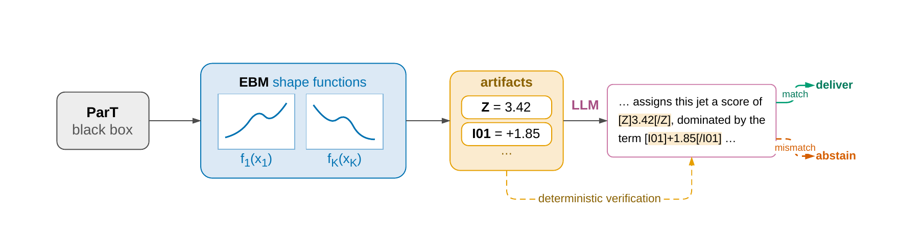

# Verified Natural-Language Explanations of Deep Classifiers in High-Energy Physics

This repository implements a pipeline that turns the decision of an opaque jet
tagger into a natural-language explanation whose every quantitative claim has
been checked. A Particle Transformer is distilled into an interpretable
Explainable Boosting Machine over physically meaningful observables; the local
artifacts of that surrogate are handed to an LLM, which must enclose every
artifact-derived number and every threshold-governed qualitative word in a
labelled tag. A deterministic parser then checks each tag against the artifact,
and the narrative is delivered only if all of them match. The system abstains
before generation when the surrogate fails to reproduce the tagger locally.

## Pipeline



ParT is distilled into an EBM surrogate; local artifacts are formatted into a
tagged prompt and passed to an LLM. A deterministic parser checks each tag
against the artifact, and the narrative is delivered only if all checks pass.

## Case Study

Jet tagging on **TopLandscape** — hadronically decaying top jets against a QCD
dijet background, anti-kT R = 0.8, pT ∈ [550, 650] GeV, on the official splits
of 1.2 M train / 400 k validation / 400 k test jets.

The tagger being explained is **ParT**, pretrained on JetClass and fine-tuned on
TopLandscape. It reads an unordered set of O(100) particle four-vectors, so an
attribution assigned to a single constituent carries no standalone physical
meaning: the explanation has to live in observable space instead. The target
distilled is the logit difference `t(j) = z_top(j) − z_qcd(j)`.

Four LLMs are benchmarked as narrators — Gemini 3.5 Flash, Gemini 3.5
Flash-Lite, DeepSeek-v4-Flash, GPT-OSS-120B — and Claude Sonnet 5 serves as an
LLM-as-a-judge, validated against two human annotators.

## Repository Structure

The repository separates observable computation, surrogate distillation,
narrative generation and evaluation, one directory per stage of the pipeline:

- `data/observables/observables_top.py`: per-jet observable computation via FastJet + fjcontrib.
- `data/observables/build_features_top.py`: joins observables to ParT logits into the feature table.
- `data/observables/fjcontrib_loader.py`: loads SoftDrop / Nsubjettiness / energy correlators through cppyy.
- `data/observables/basis_definitions.md`: the ten observables, pre-registered before any fitting.
- `data/configs/top_basis.yaml`: observable basis, truncations and surrogate fit settings.
- `data/configs/dataloader/`: weaver dataloader configs for ParT inference.
- `scripts/predict_TopLandscape_logits.py`: ParT inference saving **raw** logits, which weaver's own `--predict` does not export.
- `scripts/infer_TopLandscape_logits.sh` / `dump_toplandscape_train_val_logits.sh`: that script over test, and over train and validation.
- `surrogate/train_surrogates_top.py`: fits Ridge, EBM (zero interactions) and GBDT on `t`.
- `surrogate/eval_classifier_metrics.py`: decision agreement with ParT, accuracy and AUC against truth.
- `surrogate/seed_variance.py`: average decision ordering, and the stability of each gap across seeds.
- `surrogate/train_classifiers_label.py` / `compare_surrogate_vs_label.py`: the same models fit on truth labels, as a control.
- `surrogate/scripts/`: shell entry points for the official run and the label control.
- `surrogate/metrics/top/`: the JSON numbers those runs produce, tracked.
- `narrative/stats.py`: reference percentiles, frozen once from the test set.
- `narrative/artefact.py`: the per-jet artifact — orientation, ranking by |φ|, rounding, abstention regime.
- `narrative/generator.py`: glossary rendering, prompt assembly, prompt hashing.
- `narrative/llm_client.py`: one client for Gemini and the OpenAI-compatible providers.
- `narrative/verifier.py`: tag extraction and the five deterministic checks.
- `narrative/orchestrator.py`: execution core — abstention gate, generation, verification, retry.
- `narrative/blocks_report.py`: the pass-rate table, re-verifying every narrative.
- `narrative/make_annotation_set.py`: builds the twenty-item human annotation set.
- `narrative/configs/`, `narrative/prompts/`: thresholds, glossary, and the versioned prompt `top-v16`.
- `evaluation/judge.py`: the LLM-as-a-judge rubric runner.
- `evaluation/judge_report.py`: verdicts to spreadsheet, and `--by-model` the per-generator table.
- `evaluation/agreement.py`: human-judge agreement, weighted kappa, negative recall.
- `evaluation/annotation_set/`: the set itself — the twenty items exactly as handed out, and `KEY.csv`, the provenance the annotators never saw.
- `evaluation/results/`: everything that came back or was derived — the judge's verdicts, the two annotator sheets, the scored spreadsheets — plus the instructions and the tagged copies of the items.
- `run_judges.sh`: scores a whole block with the judge; resumable, holds a lock.
- `particle_transformer/`: the upstream ParT toolkit, vendored (see the last section).

## Getting Started

### 1) Environments

Two, because the teacher and the rest have incompatible dependency stacks.

Parts 1–4 — observables, surrogate, narrative, evaluation:

```bash
conda env create -f environment.yml
conda activate part-surrogate
```

FastJet and fjcontrib come from conda-forge rather than pip: the observables are
computed through cppyy against the C++ headers and shared libraries, which
`fjcontrib_loader.py` resolves under `sys.prefix`, so they have to live inside
this environment.

ParT inference only:

```bash
python -m venv particle_transformer/.venv
source particle_transformer/.venv/bin/activate
pip install torch weaver-core awkward
```

### 2) Data and checkpoints

Neither is in this repository. Fetch TopLandscape with the vendored downloader
and fine-tune the teacher with the vendored training script:

```bash
cd particle_transformer
./get_datasets.py TopLandscape -d datasets
./train_TopLandscape.sh ParT-FineTune kin
```

The fine-tune starts from upstream's JetClass-pretrained `models/ParT_kin.pt`,
so that file has to be in place first — this repository never trains on
JetClass itself.

### 3) Know where each part runs

**Parts 1 and 2 run from `particle_transformer/`, not from the repository
root.** That is where the datasets, the checkpoints and the weaver configs live,
and the symlinks under `particle_transformer/surrogate/` are what assemble this
repository's code into the package layout the ParT scripts import: the model
fitting sits in `surrogate/` while the feature building sits in
`data/observables/`, and only the symlink tree puts both in one importable
package. Run them from the root and `surrogate.build_features_top` is not there.

Parts 3 and 4 run from the repository root, with `export PYTHONPATH="$PWD"`.

## Usage

### Teacher logits and surrogate (Parts 1–2)

```bash
cd particle_transformer

source .venv/bin/activate
./dump_toplandscape_train_val_logits.sh     # train and validation; test already dumped

conda activate part-surrogate
./surrogate/run_official_top.sh             # features, then Ridge / EBM / GBDT
python -m surrogate.eval_classifier_metrics  --predictions surrogate/outputs/top/models/test_predictions.parquet
python -m surrogate.seed_variance            # ADO, and each gap's stability across seeds
./surrogate/run_label_classifiers.sh         # the truth-label control
```

### Narrative (Part 3)

```bash
export PYTHONPATH="$PWD"
conda activate part-surrogate

python -m narrative.stats                   # once, and again after any surrogate refit
python -m narrative.artefact --validate 3000   # offline, no API key needed

python -m narrative.orchestrator \
    --backend vertex --model gemini-3.5-flash-lite \
    --jets-file narrative/outputs/top/narratives/run100_jets.json \
    --out narrative/outputs/top/narratives/scratch_gemini-3.5-flash-lite.jsonl

python -m narrative.blocks_report           # the pass-rate table over block v16
```

`run100_jets.json` fixes which hundred jets a run covers. Every model must
narrate the same jets or half of any difference between them is sampling noise,
so the sample is drawn once into that file and loaded verbatim afterwards —
`--sample` and `--sample-seed` are ignored once it exists.

Backends and their credentials:

| `--backend` | protocol | credential |
|---|---|---|
| `aistudio` | google-genai | `GOOGLE_API_KEY` |
| `vertex` | google-genai | application default credentials |
| `deepseek` | OpenAI-compatible | `DEEPSEEK_API_KEY` |
| `groq` | OpenAI-compatible | `GROQ_API_KEY` |
| `ollama` | OpenAI-compatible | `OLLAMA_API_KEY` |

### Evaluation (Part 4)

```bash
./run_judges.sh                                # scores block v16, resumable
python -m evaluation.judge_report              # the two scored CSVs, into results/
python -m evaluation.judge_report --by-model   # mean ± SD per generator (--latex for the body)
python -m evaluation.agreement                 # human ↔ judge tables (--latex)
```

`annotation_set/` holds only what defines the set: the twenty items as the
annotators and the judge received them, and `KEY.csv` mapping each id back to
its generator and jet. Everything a run produced or consumed alongside it —
verdicts, sheets, instructions, tagged copies — is in `results/`, so the set
itself cannot drift from what was handed out. The annotator sheets are
`annotator_1.csv` and `annotator_2.csv`; sheet order fixes which is A and which
is B in the tables.

## Results

**Surrogate fidelity**, on the TopLandscape test set. ADO is average decision
ordering; the teacher's is against the physical truth ordering rather than
against itself, which is the point of the comparison — the additive surrogate
tracks the tagger's ranking about as closely as the tagger tracks the physics.

| model | R² | ADO | decision agreement | AUC |
|---|---|---|---|---|
| Ridge | 0.886 | 0.962 | 0.932 | 0.955 |
| **EBM (ours)** | **0.962** | **0.983** | **0.951** | **0.975** |
| GBDT | 0.980 | 0.988 | 0.967 | 0.979 |
| ParT (teacher) | — | 0.983 | — | 0.983 |

**Delivery under verification**, over the 90 narrated jets of the hundred-jet
sample; the abstention gate withholds the other ten before any model is called.
`TOTAL` is the strict conjunction of the five checks.

| model | Faith | Comp | Form | NoBare | Read | TOTAL |
|---|---|---|---|---|---|---|
| Gemini 3.5 Flash-Lite | 0.99 | 0.86 | 0.93 | 0.80 | 0.83 | 0.57 |
| Gemini 3.5 Flash | 0.99 | 1.00 | 1.00 | 1.00 | 0.97 | **0.96** |
| DeepSeek v4 Flash | 0.93 | 0.96 | 0.99 | 0.87 | 0.80 | 0.64 |
| GPT-OSS 120B | 0.97 | 0.13 | 0.37 | 0.24 | 0.90 | 0.10 |

All four report artifact numbers accurately, yet delivery ranges from 0.96 to
0.10: faithfulness alone is a misleading criterion, and the models fail in
different ways.

**The judge is an aggregate baseline, not a substitute for reading a
narrative.** On the twenty annotated items it reproduces the annotators'
positive/negative verdict on 95% of judgments and agrees within one point on
96%, but its quadratic-weighted kappa against them is 0.25 where the two
annotators score 0.86 against each other, and of the six human ratings at or
below 1 it caught none.

Every number above regenerates from a command in this repository. The five
deterministic checks are `Faith` (every tagged number matches the artifact),
`Comp` (all 46 required tags present), `Form` (no malformed or unknown tag),
`NoBare` (no digit outside a tag) and `Read` (every tagged word is the one its
number implies under a rule the prompt stated).

## Relationship to the ParT codebase

The teacher is trained with the upstream
[jet-universe/particle_transformer](https://github.com/jet-universe/particle_transformer)
toolkit. `particle_transformer/` vendors the parts needed to reproduce training
and inference — network definitions, dataloader, weaver configs, train scripts —
copied verbatim from upstream at commit `2925bdb`, including its own README. It
is kept verbatim on purpose, so it is the one directory here not to tidy.

## Not in this repository

The raw datasets, the trained checkpoints (`.pt`/`.pth`), the ParT teacher
logits, the surrogate feature tables and fitted models, and the narrative run
outputs. They are large and regenerable from the scripts here, and are kept
local pending external hosting. The one exception is
`narrative/outputs/top/narratives/run100_jets.json`: it defines which jets a run
covered, so a result is not reproducible without it, and it is tracked.
